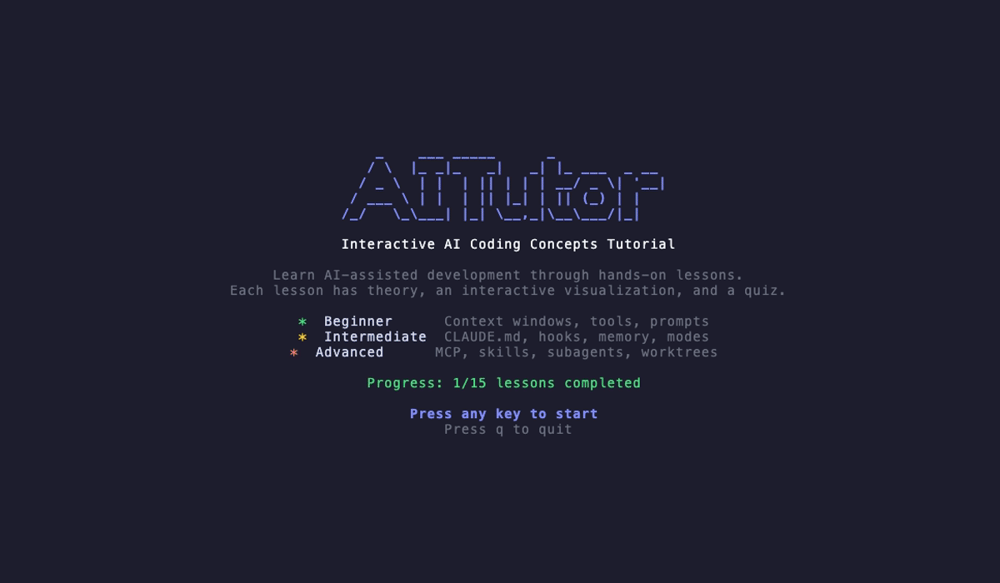

# AITutor-ZH

`AITutor-ZH` 是基于终端的 AI 编程概念中文交互教程。你可以通过 17 节课程、ASCII 可视化和测验，系统学习上下文窗口、工具调用、AGENTS.md、MCP、子代理、批量工具执行等核心概念。它的体验类似 `vimtutor`，但主题是 AI 辅助开发。


<!-- To regenerate: brew install vhs && vhs demo.tape -->



## 安装

无需额外配置，直接运行，以下安装方式安装的为英文版本：

```bash
npx @aitutor/cli@latest
```

也可以全局安装：

```bash
npm install -g @aitutor/cli@latest
aitutor
```

### Go

```bash
go install github.com/DropKbit/aitutor-cn@latest
aitutor
```

### 从源码构建

```bash
git clone https://github.com/DropKbit/aitutor-cn.git
cd aitutor
make build
./aitutor
```

## 课程目录

### 初级

| # | 课程 | 你将学到什么 |
|---|------|--------------|
| 1 | 什么是 AI 编程助手？ | 理解 observe-think-act 代理循环 |
| 2 | 上下文窗口 | 理解 token 预算、MCP 工具成本与压缩机制 |
| 3 | 工具 | 掌握 Glob、Read、Edit、Bash 等核心工具链 |
| 4 | 提示词工程 | 学会为 AI 助手编写高质量指令 |

### 中级

| # | 课程 | 你将学到什么 |
|---|------|--------------|
| 5 | 项目级 AI 配置文件 | 理解项目专属 AI 指令与范围控制 |
| 6 | 执行模式 | 理解规划模式与执行模式的决策差异 |
| 7 | 钩子（Hooks） | 学习生命周期 Hook 与自动化触发方式 |
| 8 | 记忆与持久化 | 理解会话记忆、持久存储与配置文件记忆 |
| 9 | 代理式循环 | 学习 Read → Think → Act → Observe 的迭代模式 |
| 10 | 高级提示技巧 | 掌握提升 AI 代码生成质量的七种技巧 |
| 11 | AI 代码审查 | 学会发现 AI 生成代码中的常见问题 |

### 高级

| # | 课程 | 你将学到什么 |
|---|------|--------------|
| 12 | MCP（模型上下文协议） | 理解客户端/服务端结构与工具调用方式 |
| 13 | 技能（Skills） | 理解按需加载的技能系统与工作流封装 |
| 14 | 子代理（Subagents） | 学会用并行代理拆分复杂任务 |
| 15 | Git 工作树（Worktree） | 学习并行开发中的隔离工作区 |
| 16 | 工具搜索与延迟加载工具 | 学会按需加载工具以节省上下文 |
| 17 | 批量工具调用 | 理解单工具执行策略与并行批处理 |

## 工作方式

每节课包含三个阶段：

1. **理论**：可滚动阅读的概念讲解
2. **可视化**：可交互的 ASCII 可视化演示
3. **测验**：选择题、填空题或排序题

学习进度会自动保存到 `~/.aitutor/progress.json`，下次启动后可继续学习。

## 快捷键

| 按键 | 作用 |
|------|------|
| `q` / `Ctrl+C` | 退出 |
| `Tab` | 切换侧边栏 |
| `n` / `p` | 下一课 / 上一课 |
| `→` / `Enter` | 进入下一阶段 |
| `←` / `Backspace` | 返回上一阶段 |
| `↑/↓` 或 `j/k` | 滚动 / 导航 |
| `Enter` / `Space` | 与可视化交互 |
| `?` | 打开帮助层 |

## 项目结构

```text
aitutor/
├── main.go                          # 程序入口
├── internal/
│   ├── app/                         # 根 TUI 模型、按键、消息
│   ├── ui/                          # 头部、底部、侧边栏、样式、布局
│   ├── lesson/                      # 课程状态机、注册表、渲染器
│   ├── content/
│   │   ├── beginner/                # 第 1-4 课
│   │   ├── intermediate/            # 第 5-11 课
│   │   └── advanced/                # 第 12-17 课
│   ├── viz/                         # 交互式可视化
│   ├── quiz/                        # 测验系统（选择、填空、排序）
│   └── progress/                    # JSON 持久化与进度条
└── pkg/types/                       # 共享类型（Tier、LessonDef 等）
```

## 依赖

- [bubbletea](https://github.com/charmbracelet/bubbletea)：终端 UI 框架
- [lipgloss](https://github.com/charmbracelet/lipgloss)：样式系统
- [bubbles](https://github.com/charmbracelet/bubbles)：viewport、文本输入、按键绑定等组件

除 Charm 生态外，没有引入其他外部依赖。

## 版权与致谢

本项目是对原项目 **AITutor** 的中文化整理与翻译版本，中文名称为 **AITutor-ZH**。

- 原项目作者：Naor Peled
- 原项目仓库：[github.com/naorpeled/aitutor](https://github.com/naorpeled/aitutor)
- 原项目许可证：MIT

本仓库保留原作者版权声明与 MIT 许可证文本。根据 MIT 许可证要求，分发与修改时应继续保留原始版权声明和许可说明。

## 贡献

如果你发现课程内容缺漏、翻译不准确、示例有误，或希望补充新的课程，欢迎提交 issue 或 PR：

[github.com/DropKbit/aitutor-cn](https://github.com/DropKbit/aitutor-cn)

## 免责声明

课程内容由社区贡献，部分内容可能经过 AI 辅助整理。我们会尽量保证准确性，但内容仍可能存在错误，不能替代正式培训或专业意见。欢迎提出修正与补充。

## 许可证

MIT
